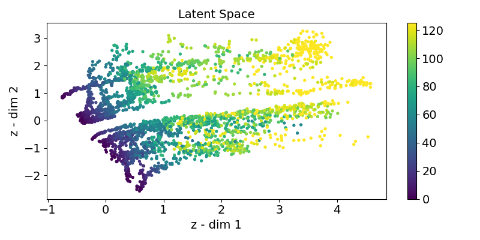

# Degradation-Trajectory-Retrieval-and-Fault-Generation

 

This repository contains the code and data for the currently submitted paper. The work was carried out by AIRI in collaboration with Mikhail Zaytsev. 

The main contributions of the research are as follows:
- We introduced self-supervised degradation space and trajectory organization losses to construct an interpretable latent space.
- We developed a novel method for preparing conditions for generative models in deteriorating systems, utilizing projections in the developed latent space.
- We validated the performance of our method using the NASA C-MAPSS dataset and other relevant problems

<p align="center">

</p>
## Table of Contents

- [Environment Details](#Environment-Details)
- [CMAPSSData](#cmapssdata) <!-- - [Notebooks](#notebooks) -->
- [Scripts](#scripts)
- [Configs](#configs)
- [Outputs](#outputs)
- [Requirements](#requirements)
- [Usage](#usage)
- [References](#references)


## Environment Details
The code in this repository was developed using the following environment:
```
python==3.9.16
numpy==1.24.3
pandas==1.5.3
matplotlib==3.7.1
torch==2.0.1
scikit-learn==1.2.0
scipy==1.9.3
tqdm==4.65.0
tslearn==0.6.1
```

## CMAPSSData

The `CMAPSSData` directory contains the engine data from the NASA CMAPSS dataset. It includes the training, testing, and RUL files for different equipment categories.
For more information about the dataset, refer to the original [readme.txt](CMAPSSData/readme.txt) file in the CMAPSSData directory.

## Scripts


Here are short descriptions of the scripts used in this project:

- [ddpm_models.py](./models/ddpm_models.py): Python script for conditional diffusion.
- [tshae_models.py](./models/tshae_models.py): Python script with Time Series Hybrid Autoencoder (TSHAE).
- [tshae_train.py](tshae_train.py): Python script for Time Series Hybrid Autoencoder training.
- [tshae_test.py](tshae_train.py): Python script for Time Series Hybrid Autoencoder test.
- [ddpm_train.py](ddpm_train.py): Python script for diffusion model training.
- [ddpm_infer_validation.py](ddpm_infer_validation.py): Python script for genrating sensor data for validation dataset.
- [ddpm_infer_latent.py](ddpm_infer_latent.py): Python script for genrating sensor data for latent space trajectories.
- [noise_tester.py](noise_tester.py): Python script for testing TSHAE for noise resistance.
- [loss.py](./utils/loss.py): Python script for loss functions.
- [metric.py](./utils/metric.py): Python script for metrics calculations.
- [metric_dataloader.py](./utils/metric_dataloader.py): Python script for C-MAPSS dataloader.
- [multirun_results_getter.py](multirun_results_getter.py): Python script for getting multi-run results.


## Configs

The `Configs` directory contains YAML configuration files for different components of the project, such as data preprocessing, diffusion, model selection, loss functions, optimizers, schedulers, and more.

The project utilizes the Hydra library for handling and managing these configurations.

- `config.yaml`: General project configuration file.
- `data_preprocessor`: Configuration files for data preprocessing related settings.
- `diffusion`: Configuration files for diffusion-related settings.
- `knnmetric`: Configuration files for latent space KNN metric.
- `model`: Configuration files for model selection and architecture settings.
- `loss`: Configuration files for different loss functions.
- `noise_tester`: Configuration files for testing TSHAE for noise resistance.
- `optimizer`: Configuration files for optimizer settings.
- `scheduler`: Configuration files for learning rate scheduler settings.
- `random_seed`: Configuration file for setting random seed.
- `trainer`: Configuration files for training TSHAE.

## Outputs

The `Outputs` directory is used to store the output files generated during the project, such as trained model weights, evaluation results, and plots.

## Requirements

The `requirements.txt` file contains the necessary Python packages and dependencies to run the code in this repository.

## Usage

To use this code, follow these steps:

1. Install the required dependencies by running: `pip install -r requirements.txt`.
2. Update the necessary configurations in the `Configs` directory to match your specific needs.
3. Run the desired scripts or notebooks for data preprocessing, model training, testing, and evaluation.


To run multiple train TSHAE experiments with Hydra sweeper:

```console
python tshae_train.py -m hydra.sweeper.max_batch_size=10
```
To gather results of Hydra multirun experiment:
```console
python multirun_results_getter.py --multirun_path "./path_to_multirun_experiment/"
```
To test TSHAE
```console
python tshae_test.py --checkpoint_path ./best_models/FD003/tshae/
```

To infer generated sensor signals by DDPM model:
```console
python ddpm_infer_validation.py
```


